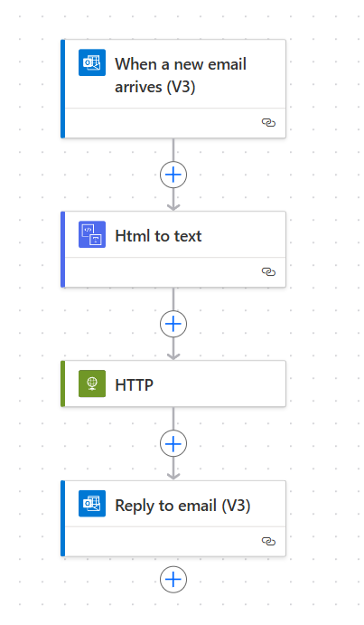
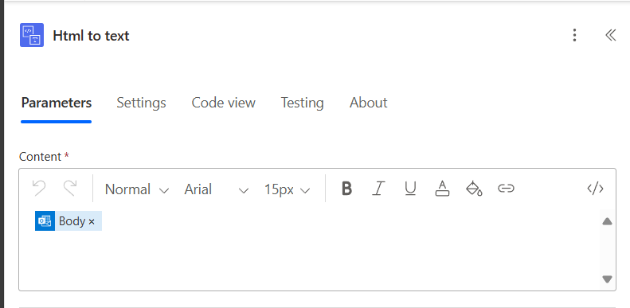
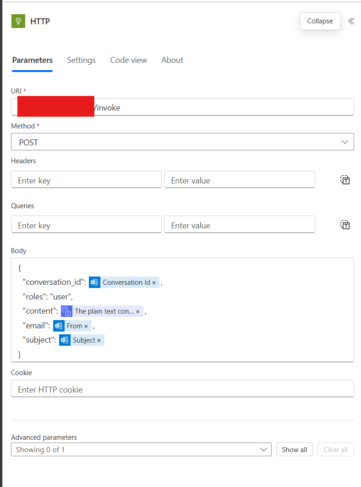
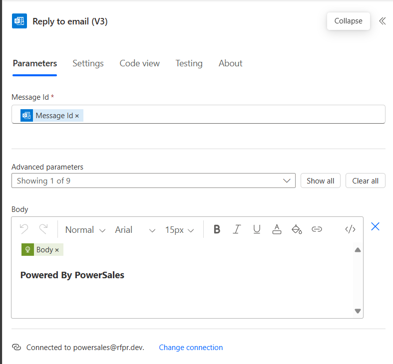

# Power Sales

Power Sales is powerful omni channel sales agent that could response client inquiries, provide product information, and process orders. Enhanced with Azure AI search and GPT 4o, Power Sales is able to provide a more accurate and efficient service to your clients.

## Installation

1. Change the CI/CD pipeline in .github/workflows/actions.yml to your own Azure Container Registry
2. Add document of your product to documents
3. Run the indexer in RAG folder
4. Run the SQL query on database.sql
5. Configure Power Automate

6. Deploy the Power Sales dashboard to Power Apps